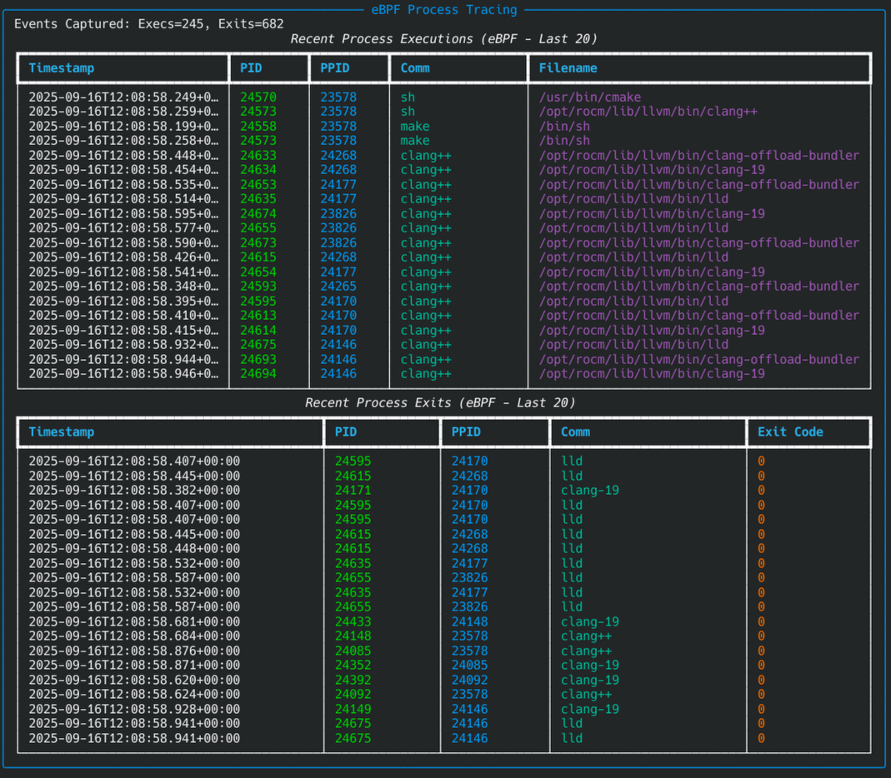

[](https://github.com/genie-tooling/sysdiag_analyzer/actions/workflows/python-test.yml)

Systemd & System Health Diagnostic Tool

This tool analyzes systemd units, boot performance, resource utilization,
system logs, unit dependencies, historical trends, and process activity to provide
a comprehensive health assessment. It leverages native Linux features, optional
ML anomaly detection, LLM synthesis, and eBPF tracing for deep insights.

**ANOMALY DETECTION WORK IN PROGRESS**
The anomaly detection tends to work but is still under active development and tuning.

The LLM analysis and overall health check does tend to work as expected.

Training can be memory intensive so the recommendation is to build a base line of > 300 reports and run `retrain-ml` once, and then only run this if your baseline changes significantly and not on production systems during peak traffic times!


eBPF requires a bit of extra OS packages like eBPF tooling, kernel headers, python libraries but also works as expected.



**For exhaustive details on configuration, options, and interpretation, please see the `MAN.md` file.**

## Features

*   **Boot Analysis:** Timing breakdown, unit activation times, critical chain.
*   **Service Health Checks:** Failed/flapping units, socket/timer issues. (DBus/cysystemd preferred)
*   **Resource Utilization Monitoring:**
    *   System-wide (psutil).
    *   Per-unit (cgroup v2 via DBus). Top N consumers.
    *   **Child Process Group Monitoring:** Aggregates CPU/Memory for process groups not directly managed by systemd (e.g., Docker containers spawned by `docker.service`), linking them back to the parent unit. Useful for understanding resource usage of containerized workloads.
*   **Log Analysis (Current Boot):** OOM Killer, common error/warning patterns (segfaults, I/O errors, etc.). (cysystemd preferred)
*   **Dependency Analysis (Failed Units):** Checks dependencies of failed units to identify potential root causes.
*   **Full Dependency Graph Analysis (Optional):** Detects circular dependencies (`networkx` required). *Note: Accuracy depends on parsing `systemctl` output, which may vary.*
*   **eBPF Process Tracing (Optional):**
    *   Traces process `exec` and `exit` events system-wide during the analysis run (`bcc` required).
    *   Provides insights into short-lived processes or unexpected executions.
    *   Requires **root privileges** and specific system libraries (see Prerequisites).
*   **Historical Persistence:** Saves reports (JSONL.gz) to `/var/lib/sysdiag-analyzer/history/` (configurable), applies retention policy.
*   **ML Anomaly Detection (LSTM Autoencoder):**
    *   Trains a model per unit on historical metrics (`.[ml]` extras required).
    *   Detects deviations from learned temporal patterns. A **high score** (reconstruction error) suggests a potential anomaly.
    *   By default, excludes device, slice, and scope units from training to conserve memory. Use the `--train-devices` flag to include them.
*   **LLM Synthesis (Optional):** Uses a local LLM (via Ollama) to synthesize the report (`.[llm]` extra and Ollama setup required).

## Prerequisites

*   Python 3.8+
*   Linux system with **systemd** and **cgroup v2** enabled.
*   Access to systemd (DBus preferred), journald, `/sys/fs/cgroup`, `/proc`.
*   **Root privileges** generally required for full data access, eBPF, and default history/model saving.
*   **Core Dependencies:** `typer[all]`, `rich`, `psutil`, `tomli` (Python < 3.11), `pygments`.
*   **(Optional)** `cysystemd`, `dbus-python` (`.[native]`)
*   **(Optional Extras)** `networkx` (`.[full-graph]`), `pandas`, `scikit-learn`, `tensorflow`, `joblib` (`.[ml]`), `ollama` (`.[llm]`).

*   **(Optional for eBPF Tracing)**: Enabling the `--enable-ebpf` flag has specific system requirements:
    1.  **BCC (BPF Compiler Collection):** The `bcc` library and tools must be installed.
    2.  **Kernel Headers:** You must have the kernel headers matching your currently running kernel.
    3.  **Root Privileges:** The feature must be run with `sudo` or as root.

    **Example Installation:**
    *   **Debian / Ubuntu:**
        ```bash
        sudo apt update && sudo apt install -y bpfcc-tools libbpfcc-dev linux-headers-$(uname -r)
        ```
    *   **Fedora / CentOS Stream / RHEL:**
        ```bash
        sudo dnf install -y bcc bcc-devel kernel-devel
        ```

## Configuration (Optional)

While `sysdiag-analyzer` works out-of-the-box with sensible defaults, its advanced features can be customized via a TOML configuration file.

**Locations:**
The tool searches for `config.toml` in the following order, with settings from later files overriding earlier ones:
1.  System-wide: `/etc/sysdiag-analyzer/config.toml`
2.  User-specific: `~/.config/sysdiag-analyzer/config.toml`
3.  A custom path can be specified with the global `--config` option.

You can always see the final, merged configuration that is being used by running:```bash
sysdiag-analyzer config show
```

**Key Settings:**
*   `[llm]`: Configure the Large Language Model for report synthesis.
    *   `provider`: Set to `"ollama"` to use a local Ollama instance.
    *   `model`: Specify the model name to use (e.g., `"llama3:latest"`). This model must be downloaded in your Ollama instance.
    *   `host`: (Optional) The URL of the Ollama API if it's not running on `http://localhost:11434`.
*   `[history]`: Customize data persistence.
    *   `directory`: Change the default path (`/var/lib/sysdiag-analyzer/history`) where analysis reports are saved.
    *   `max_files`: Set the number of old reports to keep.
*   `[models]`: Customize Machine Learning model storage.
    *   `directory`: Change the default path (`/var/lib/sysdiag-analyzer/models`) where trained ML models are saved.

For a full list of all configuration options, please refer to the `MAN.md` file or the `config.toml.example` file included in the source code.

## Installation

```bash
# Recommended: Use a virtual environment
python3 -m venv .venv
source .venv/bin/activate

# Install base package (includes pygments for highlighting)
pip install . "pygments"

# Install optional features (choose needed extras)
# Example: pip install ".[ml,llm,ebpf]"

# For development:
pip install -e ".[dev]"
```
See `MAN.md` for detailed system dependency installation examples.

## Usage

See `MAN.md` for detailed examples and option explanations.

```bash
# Full analysis (requires sudo, saves report)
sudo sysdiag-analyzer run

# Enable optional analyses
sudo sysdiag-analyzer run --enable-ebpf --analyze-ml --analyze-llm

# Specific module
sudo sysdiag-analyzer analyze-health

# Retrain ML models on the last 300 reports (default)
sudo sysdiag-analyzer retrain-ml

# Retrain including device units (WARNING: HIGH MEMORY USAGE)
sudo sysdiag-analyzer retrain-ml --train-devices

# Show history
sudo sysdiag-analyzer show-history

# Show config
sysdiag-analyzer config show
```

## Sharing models across **IDENTICAL** systems

If you have a fleet of identical apache servers running on the same hardware, you can absolutely share the models across them.

### Step-by-Step Instructions

Here are the practical commands for the export/import process. These commands should be run as `root` or with `sudo`.

#### Step 1: Train the Models on a Reference VM

On one VM that you consider the "source of truth" for normal behavior, run the retraining command. Use a large enough window to get a good baseline.

```bash
# On your reference VM (e.g., vm-primary-01)
sudo sysdiag-analyzer retrain-ml --num-reports 500
```

This will populate the `/var/lib/sysdiag-analyzer/models/` directory with all the trained model artifacts.

#### Step 2: Export the Models

Still on the reference VM, package the entire models directory into a tarball.

```bash
# Define a version or date for the package
TIMESTAMP=$(date +"%Y%m%d")
MODEL_PACKAGE="sysdiag-models-v${TIMESTAMP}.tar.gz"

# Create the compressed archive
sudo tar -czvf "${MODEL_PACKAGE}" -C /var/lib/sysdiag-analyzer/ models

# The '-C' option tells tar to change to that directory first, 
# so the archive paths will be 'models/...' instead of the full absolute path.
```

You will now have a file named something like `sysdiag-models-v20250917.tar.gz` in your current directory.

#### Step 3: Distribute the Model Package

Copy this package to a target VM. You can do this manually with `scp` or, preferably, automate it with a configuration management tool.

**Manual Example (using `scp`):**

```bash
# From your local machine or the reference VM
scp ./${MODEL_PACKAGE} user@target-vm-01:/tmp/
```

#### Step 4: Import and Deploy on Target VMs

On each target VM, unpack the archive into the correct location. It's best practice to remove the old models first to ensure a clean state.

```bash
# On your target VM (e.g., vm-target-01)
MODEL_PACKAGE="/tmp/sysdiag-models-v20250917.tar.gz"
MODELS_BASE_DIR="/var/lib/sysdiag-analyzer"

# 1. (Optional but Recommended) Remove the old models directory
sudo rm -rf "${MODELS_BASE_DIR}/models"

# 2. Ensure the base directory exists
sudo mkdir -p "${MODELS_BASE_DIR}"

# 3. Unpack the new models into the base directory
sudo tar -xzvf "${MODEL_PACKAGE}" -C "${MODELS_BASE_DIR}"

# 4. (Optional) Verify permissions are appropriate
# The user running sysdiag-analyzer needs read access.
# If that user is not root, you may need to adjust permissions.
```

After these steps, the `/var/lib/sysdiag-analyzer/models` directory on the target VM will be an exact copy of the one from your reference VM.


## Interpreting Special Features

*   **ML Anomalies:** The score is a "reconstruction error." A score near 0 is normal. A **high score** indicates the unit's current behavior deviates from its learned historical patterns and is potentially anomalous.
*   **eBPF:** Look for unexpected process executions (filename/comm), frequent short-lived processes, or non-zero exit codes correlated with failures.
*   **Child Processes:** Useful for identifying resource usage by workloads (like containers) started by systemd services (e.g., `docker.service`). High aggregate CPU/Memory for a command under a specific parent unit warrants investigation.

## Development

```bash
# Basic dev workflow
pip install -e ".[dev]"
pytest
mypy src
ruff check src tests --fix
ruff format src tests
```