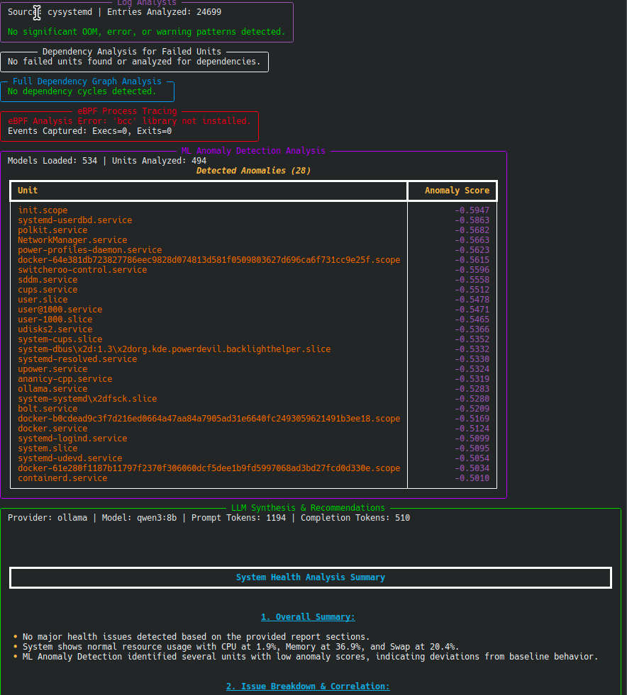

# sysdiag-analyzer

[](https://github.com/systemd-smartfilter-architect/sysdiag-analyzer/actions/workflows/python-test.yml)

Systemd & System Health Diagnostic Tool. Version: 0.6.0 (Post-Phase 10)

This tool analyzes systemd units, boot performance, resource utilization,
system logs, unit dependencies, historical trends, and process activity to provide
a comprehensive health assessment. It leverages native Linux features, optional
ML anomaly detection, LLM synthesis, and eBPF tracing for deep insights.



**For exhaustive details on configuration, options, and interpretation, please see the `MAN.md` file.**

## Features

*   **Boot Analysis:** Timing breakdown, unit activation times, critical chain.
*   **Service Health Checks:** Failed/flapping units, socket/timer issues. (DBus/cysystemd preferred)
*   **Resource Utilization Monitoring:**
    *   System-wide (psutil).
    *   Per-unit (cgroup v2 via DBus). Top N consumers.
    *   **Child Process Group Monitoring:** Aggregates CPU/Memory for process groups not directly managed by systemd (e.g., Docker containers spawned by `docker.service`), linking them back to the parent unit. Useful for understanding resource usage of containerized workloads.
*   **Log Analysis (Current Boot):** OOM Killer, common error/warning patterns (segfaults, I/O errors, etc.). (cysystemd preferred)
*   **Dependency Analysis (Failed Units):** Checks dependencies of failed units to identify potential root causes.
*   **Full Dependency Graph Analysis (Optional):** Detects circular dependencies (`networkx` required). *Note: Accuracy depends on parsing `systemctl` output, which may vary.*
*   **eBPF Process Tracing (Optional):**
    *   Traces process `exec` and `exit` events system-wide during the analysis run (`bcc` required).
    *   Provides insights into short-lived processes or unexpected executions.
    *   Requires **root privileges** and potentially matching kernel headers.
*   **Historical Persistence:** Saves reports (JSONL.gz) to `/var/lib/sysdiag-analyzer/history/` (configurable), applies retention policy.
*   **ML Anomaly Detection (Basic):**
    *   Trains `IsolationForest` per unit on historical metrics (`.[ml]` extras required).
    *   Detects deviations in the current run. Lower scores (e.g., < -0.1) suggest anomalies.
    *   Reports units skipped during training due to zero variance (normal for stable units).
*   **LLM Synthesis (Optional):** Uses a local LLM (via Ollama) to synthesize the report (`.[llm]` extra and Ollama setup required).

## Prerequisites

*   Python 3.8+
*   Linux system with **systemd** and **cgroup v2** enabled.
*   Access to systemd (DBus preferred), journald, `/sys/fs/cgroup`, `/proc`.
*   **Root privileges** generally required for full data access, eBPF, and default history/model saving.
*   **Core Dependencies:** `typer[all]`, `rich`, `psutil`, `tomli` (Python < 3.11).
*   **(Optional)** `cysystemd`, `dbus-python` (`.[native]`)
*   **(Optional Extras)** `networkx` (`.[full-graph]`), `pandas`, `scikit-learn`, `joblib` (`.[ml]`), `ollama` (`.[llm]`), `bcc` (`.[ebpf]`).

## Configuration (Optional)

Optional TOML file: `/etc/sysdiag-analyzer/config.toml` or `~/.config/sysdiag-analyzer/config.toml`. See `MAN.md` for details.

## Installation

```bash
# Recommended: Use a virtual environment
python3 -m venv .venv
source .venv/bin/activate

# Install base package
pip install .

# Install optional features (choose needed extras)
# Example: pip install ".[ml,llm,ebpf]"

# For development:
pip install -e ".[dev]"
```
See `MAN.md` for detailed system dependency installation examples.

## Usage

See `MAN.md` for detailed examples and option explanations.

```bash
# Full analysis (requires sudo, saves report)
sudo sysdiag-analyzer run

# Enable optional analyses
sudo sysdiag-analyzer run --enable-ebpf --analyze-ml --analyze-llm

# Specific module
sudo sysdiag-analyzer analyze-health

# Retrain ML models
sudo sysdiag-analyzer retrain-ml

# Show history
sudo sysdiag-analyzer show-history

# Show config
sysdiag-analyzer config show
```

## Interpreting Special Features

*   **ML Anomalies:** Lower scores indicate higher anomaly likelihood. Zero variance skips are normal for unchanging units.
*   **eBPF:** Look for unexpected process executions (filename/comm), frequent short-lived processes, or non-zero exit codes correlated with failures.
*   **Child Processes:** Useful for identifying resource usage by workloads (like containers) started by systemd services (e.g., `docker.service`). High aggregate CPU/Memory for a command under a specific parent unit warrants investigation.

## Development

See `CONTRIBUTING.md`.

```bash
# Basic dev workflow
pip install -e ".[dev]"
pytest
mypy src
ruff check src tests --fix
ruff format src tests
```
